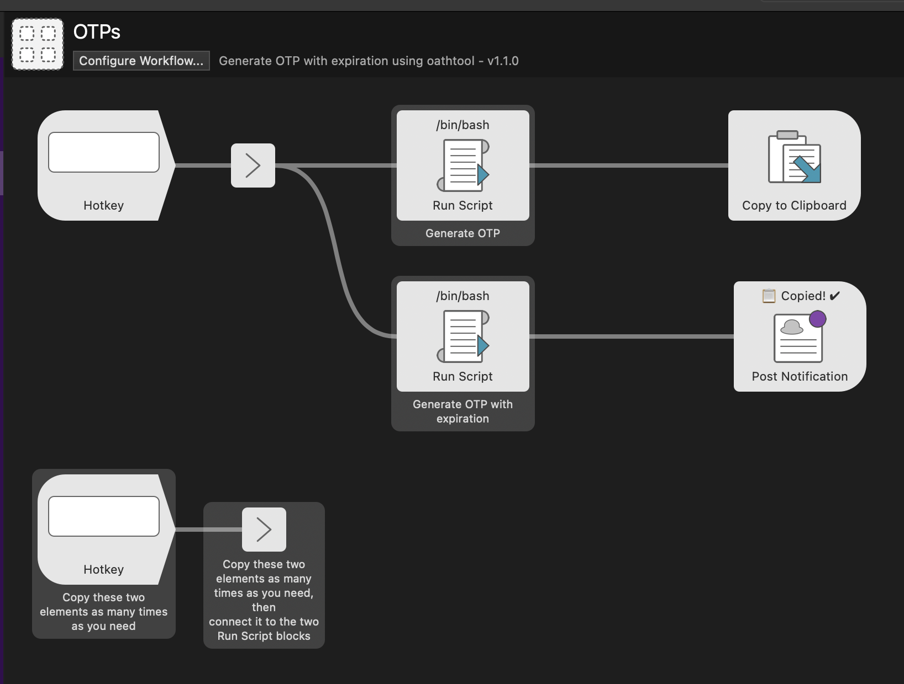
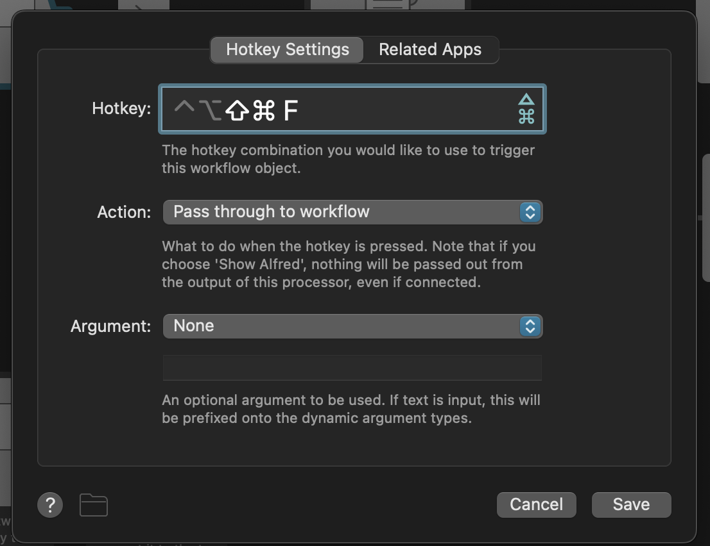
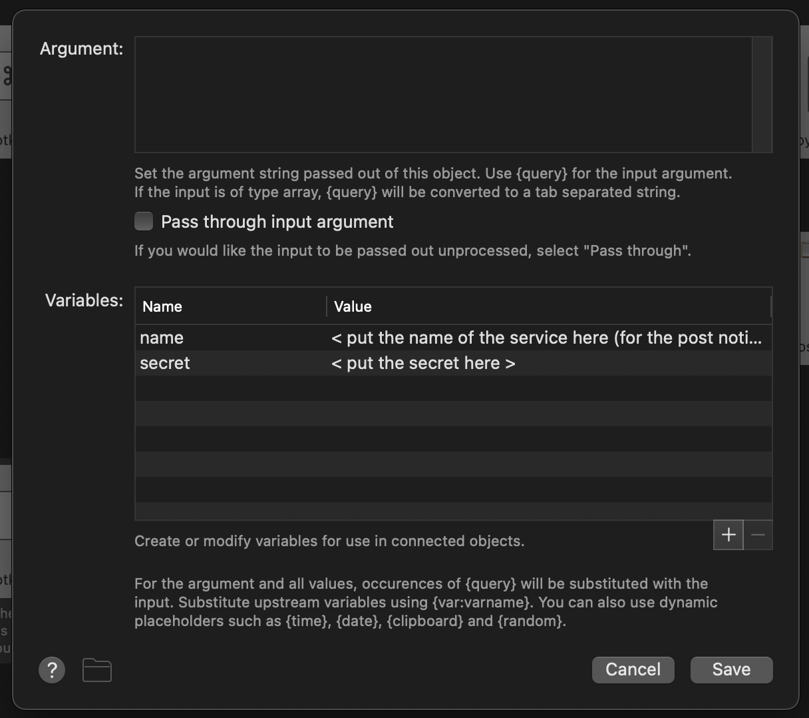
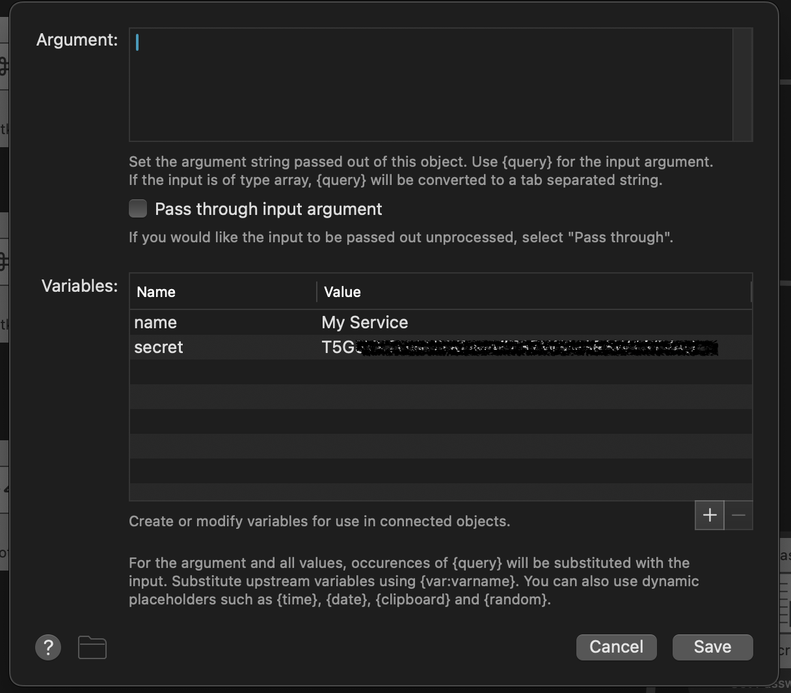

# OTP-alfred-workflow
An Alfred Workflow for generating OTPs using oathtool and copying them to clipboard,
showing an useful notification with the expiration.

## Prerequisites
- [oathtool](https://www.nongnu.org/oath-toolkit/)  

Install it using your package manager or download it from the official website.  
The simplest way to install it on macOS is using Homebrew:  
`brew install oath-toolkit`

## Usage

1. Import the workflow .otp file in Alfred, by double-clicking it.   
2. Set the hotkey you want to use to trigger the workflow by double-clicking on the hotkey block.   
3. Open the args and variables block by double click on the **>** symbol.   
4. Set name and secret key of your OTP by filling the `name` and `secret` variables.      
5. Copy the first two blocks and repeat the steps 3 and 4 for each OTP you want to generate.
6. Enjoy your OTPs!
